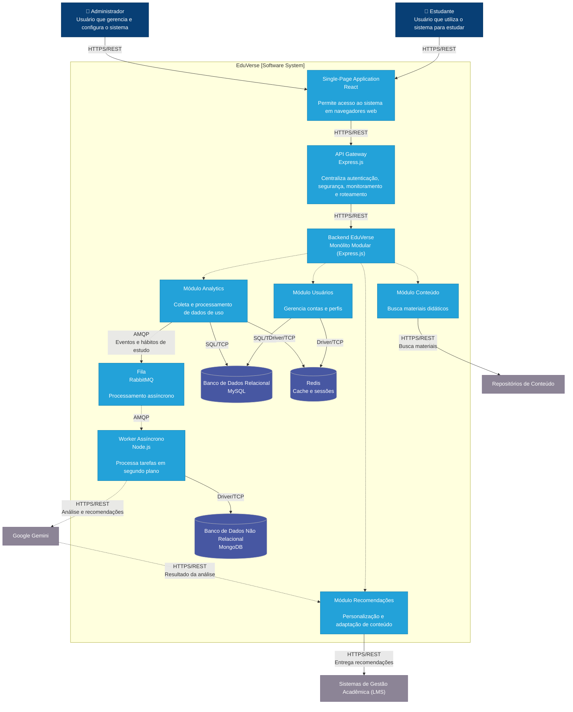

# EduVerse - Plataforma de Aprendizado Adaptativo

## Visão Geral

O EduVerse é uma plataforma de aprendizado adaptativo que utiliza inteligência artificial para personalizar a experiência educacional de cada estudante. O sistema analisa hábitos de estudo, desempenho acadêmico e consumo de conteúdo para gerar recomendações individualizadas de materiais e trilhas de aprendizagem.

Ela busca resolver o problema de ambientes tradicionais de ensino online, onde normalmente é oferecido o mesmo conteúdo para todos os estudantes, desconsiderando diferenças de ritmo, desempenho e preferências individuais.

## Estado Atual do Projeto

O projeto encontra-se na **Fase 3 do Mini Projeto O Arquiteto Decisor**, possuindo:

* Cenário de negócio definido.
* Requisitos funcionais e não funcionais documentados.
* Diagrama de Contexto (C4 Nível 1).
* Diagrama de Containers (C4 Nível 2).
* Arquitetura Monolítica Modular definida.
* Estratégia de persistência poliglota (MySQL, MongoDB e Redis).
* Estratégia de implantação em nuvem baseada em IaaS.
* Estratégias de resiliência documentadas.
* Architecture Decision Records (ADRs) registrados.

---

# Atributos de Qualidade Priorizados

* Segurança
* Performance
* Usabilidade
* Manutenibilidade
* Escalabilidade

---

# Arquitetura de Containers (C4 - Nível 2)

---

# Principais Tecnologias

| Camada           | Tecnologia               |
| ---------------- | ------------------------ |
| Frontend         | React                    |
| Backend          | Node.js                  |
| Banco Relacional | MySQL                    |
| Banco NoSQL      | MongoDB                  |
| Cache            | Redis                    |
| Mensageria       | RabbitMQ                 |
| Cloud            | GCP (IaaS)               |
| IA               | Gemini                   |

---

# Estratégia de Implantação

A arquitetura será implantada em ambiente Cloud utilizando o modelo **Infrastructure as a Service (IaaS)**.

Características principais:

* Escalabilidade vertical inicialmente.
* Evolução para escalabilidade horizontal quando necessário.
* Balanceamento de carga em cenários de crescimento.
* Monitoramento de infraestrutura e aplicação.
* Cache distribuído utilizando Redis.
* Processamento assíncrono de recomendações através de filas.

---

# Estratégias de Resiliência

Para aumentar disponibilidade e tolerância a falhas, a arquitetura utiliza:

* API Gateway
* Circuit Breaker
* Bulkhead
* Cache de recomendações
* Processamento assíncrono
* Fila de espera para solicitações à IA

---

# Architecture Decision Records (ADRs)

Os principais registros de decisão arquitetural podem ser encontrados em:

- [ADR 003 - Estratégia de implantação em Nuvem e Escalabilidade](./docs/adrs/ADR_003.md)
- [ADR 004 - Padrões de Resiliência (API Gateway, Circuit Breaker e Bulkhead)](./docs/adrs/ADR_004.md)
- [ADR 005 - Modelo de Comunicação Híbrido (Síncrono e Assíncrono)](./docs/adrs/ADR_005.md)